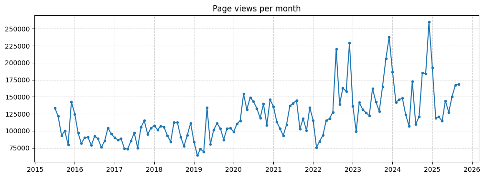
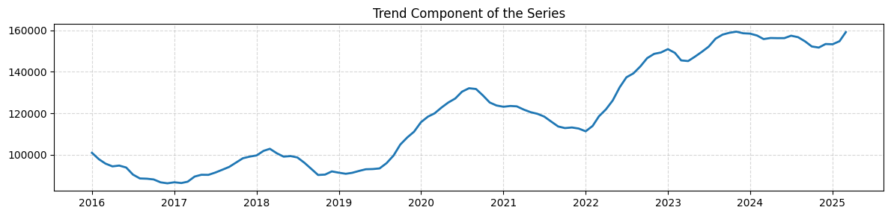
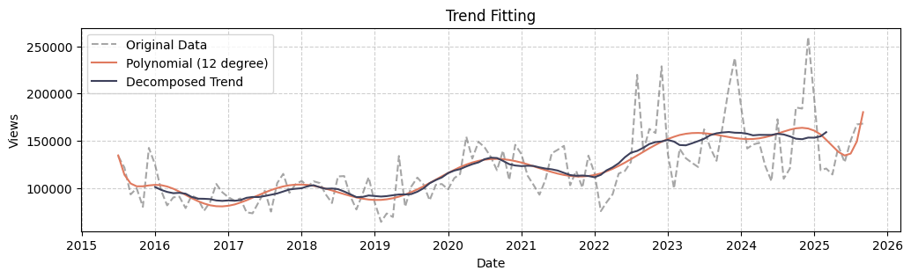
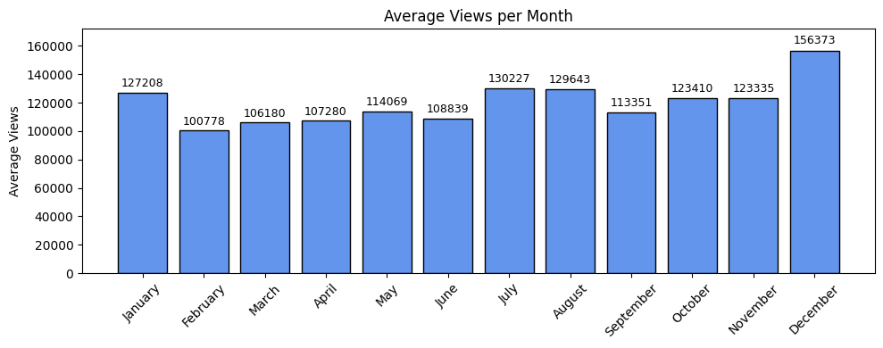
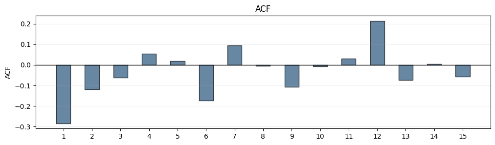
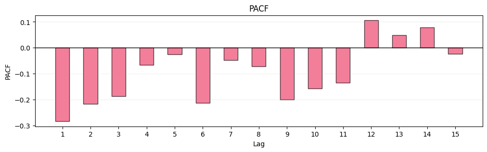
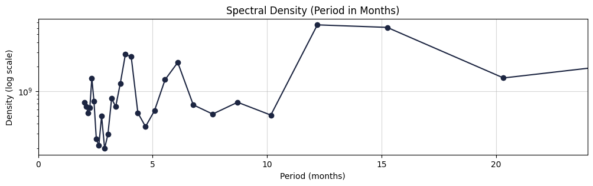
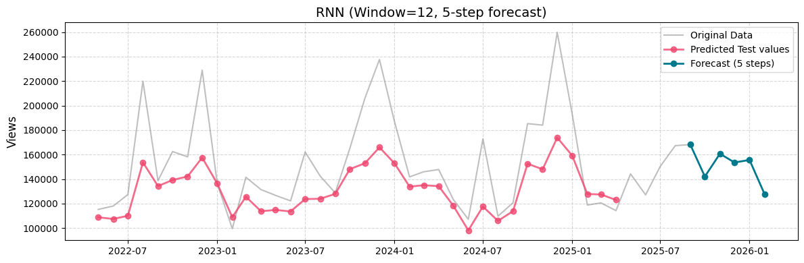
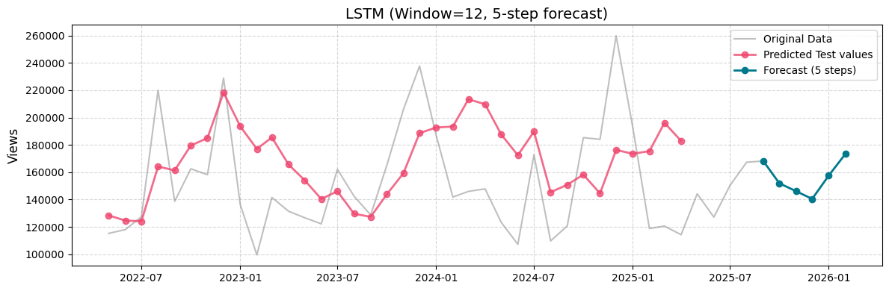

# Time Series Analysis: Wiki Page Views for "Eyes Wide Shut"

## Overview
Analysis of monthly Wikipedia page views for *"Eyes Wide Shut"* (English) from **July 2015 to September 2025** (123 data points). The goal is to understand the underlying structure of the data, including trends, seasonality, and potential irregular patterns.


&nbsp;

Wiki page: [Wikipedia: Eyes Wide Shut](https://en.wikipedia.org/wiki/Eyes_Wide_Shut)

Data source: [Wikipedia: Eyes Wide Shut - Views](https://pageviews.wmcloud.org/?project=en.wikipedia.org&platform=all-access&agent=user&redirects=0&start=2015-07&end=2025-09&pages=Eyes_Wide_Shut)

Here is the visualization of the original time series data:



## Exploratory Analysis

### Trend and Structure



The series exhibits a clear upward trend, especially after 2018. Trend analysis and filtering (including polynomial approximation and HP filter) confirm long-term growth with moderate cyclical behavior.

To better isolate the trend, a polynomial function was fitted to the data. This approximation closely follows the underlying trend, allowing construction of a detrended series for further analysis.



### Seasonality



Seasonal patterns are evident, with higher average pageviews observed during winter (December–January) and summer (July–August). These peaks are consistent with periods of increased user activity, although variability within these months remains high.

### Transformation and Stationarity

To prepare the data for modeling, a logarithmic transformation and first differencing were applied. The transformed series shows stable variance and no visible trend.

Statistical tests (Dickey–Fuller) confirm stationarity, while distribution tests indicate that the differenced series is approximately normally distributed.

## Correlation and Spectral Analysis

In this part, we analyze the internal structure of the time series using autocorrelation (ACF), partial autocorrelation (PACF), and spectral methods. The goal is to better understand repeating patterns and dependencies in the data.

### Autocorrelation (ACF) and Partial Autocorrelation (PACF)





The ACF shows a strong correlation at lag 1, which is expected for time series data. More interestingly, noticeable correlations appear around 6 and 12 months, suggesting repeating seasonal behavior.

The PACF gives a slightly different view. It highlights stronger short-term dependencies (lags 1–3), while longer lags become less important. This means that part of the seasonal effect seen in ACF is likely explained by shorter-term relationships.

Overall, these plots confirm that the series is not random — it has clear structure with both short-term dependencies and seasonal cycles.

### Spectral Analysis



To further explore periodic behavior, spectral analysis was applied using the Welch method. This approach helps identify dominant cycles in the data by looking at how different frequencies contribute to the overall signal.

The spectral plot highlights clear cycles around:
- ~6 months  
- ~12–15 months  

Shorter cycles also appear, but they are less stable and more affected by noise.

## Prediction with Neural Networks

In this part, neural networks are used to predict future pageviews based on past behavior. Two models are compared: a basic RNN and a more advanced LSTM.

Instead of predicting one step at a time, the models take a window of 12 months and predict the next 5 months at once. This helps capture yearly patterns more effectively.

### RNN



The RNN model manages to follow the general shape of the series quite well. On the test data, predictions stay close to the real values and correctly reflect the overall direction of the series.

However, the model tends to smooth the data — it doesn’t fully capture sharp peaks and drops. This means it slightly underestimates strong changes in views.  

For the future forecast, the model predicts a decline at the beginning of the year, which aligns with the typical seasonal behavior observed earlier.

### LSTM



The LSTM model produces more dynamic predictions. Compared to the RNN, it reacts more strongly to changes and shows larger fluctuations.

This allows it to better capture spikes in the data, but at the same time makes predictions less stable. In some places, the curve looks slightly distorted or overreacts to recent changes.

In the future forecast, the LSTM predicts a more aggressive increase in views around the holiday period, which is consistent with seasonal patterns but more extreme than the RNN output.

## Insights and Applications

The data shows that interest in the movie clearly follows seasonal patterns — there are noticeable peaks during winter holidays and in the summer. At the same time, there are unexpected spikes that don’t follow a clear pattern, which likely come from external factors like media attention or renewed interest in the actors.

Even though the models capture the overall trend and seasonality quite well, they struggle with these sudden changes. This shows that real-world behavior isn’t fully predictable just from historical data.

From a practical perspective, these results can be useful for forecasting demand and planning content-related strategies. For example:
- anticipating periods of increased interest  
- optimizing release timing or marketing campaigns  
- understanding when audience engagement is more volatile

## Notes

More detailed analysis can be found in the notebooks, which are structured and include comments explaining each step.

To install the required libraries for the project:
```bash
pip install -r requirements.txt
```
